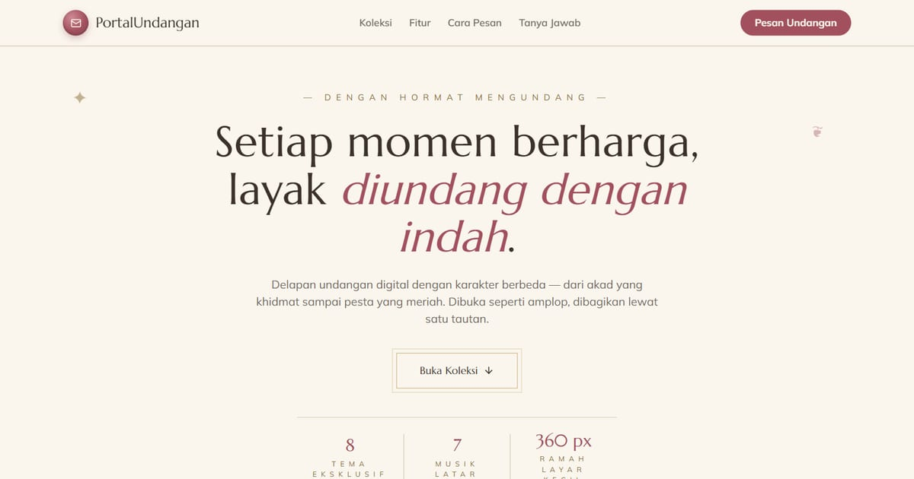

# PortalUndangan — Undangan Digital untuk Setiap Momen

PortalUndangan: 8 undangan digital dengan karakter berbeda — pernikahan, lamaran, khitanan, aqiqah, ulang tahun, wisuda, reuni, dan korporat.

**Demo live:** https://portal-undangan-eta.vercel.app



> Katalog demo milik PintuWeb. Setiap kartu menautkan ke demo live yang bisa dicoba.

## Konsep

Katalog undangan digital. Elegan dengan bingkai ganda, lencana segel lilin, dan filter kategori (Cinta, Keluarga, Perayaan, Formal).

## Varian yang dipamerkan (8)

- [Undangan Aqiqah Digital](https://undangan-aqiqah-puce.vercel.app)
- [Undangan Ulang Tahun Digital](https://undangan-birthday.vercel.app)
- [Undangan Acara Korporat Digital](https://undangan-corporate-delta.vercel.app)
- [Undangan Tunangan Digital](https://undangan-engagement.vercel.app)
- [Undangan Khitanan Digital](https://undangan-khitanan-theta.vercel.app)
- [Undangan Reuni Digital](https://undangan-reuni-livid.vercel.app)
- [Undangan Pernikahan Digital](https://undangan-wedding-eight.vercel.app)
- [Undangan Wisuda Digital](https://undangan-wisuda-ten.vercel.app)

## Halaman

`/`

## Teknologi

- Next.js 15.5 (App Router) dan React 19
- Tailwind CSS v4
- JavaScript
- Framer Motion, Lucide (ikon)
- Font: Marcellus, Mulish (next/font)
- SEO: metadata per halaman, Open Graph, JSON-LD, sitemap.xml, dan robots.txt

## Menjalankan secara lokal

```bash
npm install
npm run dev
```

Buka http://localhost:3000. Untuk build produksi: `npm run build` lalu `npm start`.

---

Dibuat oleh [PintuWeb](https://www.pintuweb.com), jasa pembuatan website.
